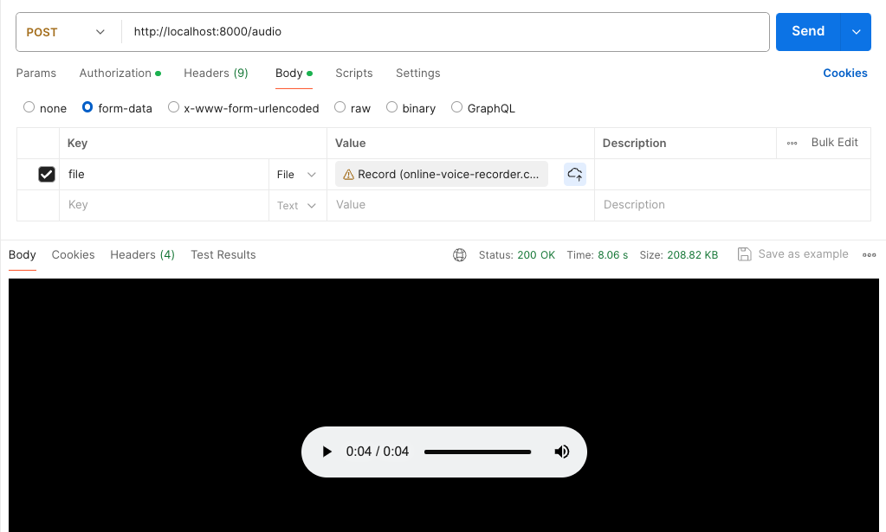

# fastapi-swe-interviewer-voice-chatbot

A FastAPI application that simulates a conversational interview between you and a custom AI assistant acting as a hiring manager, helping you prepare for common frontend developer interview questions.

Simply upload an audio file with your response, and the chatbot will generate a follow-up question or feedback.

The chatbot also keeps tracks of the conversation history, allowing you to review and improve your responses.

## Postman Example Usage

1. Upload an audio file to **http://localhost:8000/audio**
2. Receive an audio response as a streaming response



## Requirements

- Python 3.8+
- FastAPI
- Transformers
- aiofiles
- requests
- Poetry (for dependency management)

## Installation

1. **Clone the repository :**
```bash
git clone https://github.com/jaunewick/fastapi-swe-interviewer-voice-chatbot.git
cd fastapi-swe-interviewer-voice-chatbot
```

2. **Install the required packages using Poetry :**
```bash
poetry install
```

3. **Set up your environment variables :**
- Create a `.env` file in the project root directory.
- Add your Hugging Face API token :

```md
HUGGINGFACEHUB_API_TOKEN=<your_token_here>
```

4. **Run the application using :**
```bash
fastapi dev app/main.py
```
